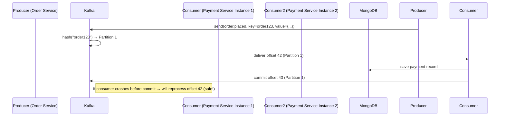

https://grok.com/share/bGVnYWN5_23cbf704-66dd-4deb-aa84-21dc69c27827

### 🔴 Ok now teach me details about offset ,partioning ,partitioning key (how they work),commit, so i can clearly understand all things to apply in my project, please give the details in a concept order meaning the concept needed to read before you give thoose before

Perfect! Let’s learn Kafka **step by step in the exact logical order** you need to understand before moving to the next concept.  
I will explain everything as if you are going to implement it tomorrow in your MERN microservices project.

### Step 1: Topic – The Stream of Events
- A **topic** is just a name (like a channel): `order.placed`, `user.registered`, `payment.failed`
- Think of it as an infinite append-only log file (like Git commits or MongoDB oplog).
- You never “update” or “delete” events — you only append new ones.

### Step 2: Partition – Parallelism + Ordering Inside a Topic
- Every topic is split into one or more **partitions**.
- Each partition is a separate, ordered, immutable log.
- Partitions live on different brokers (servers) → enables parallelism.

```
Topic: order.placed
├── Partition 0 → [event1] → [event2] → [event5] → [event8] ...
├── Partition 1 → [event3] → [event4] → [event9] ...
└── Partition 2 → [event6] → [event7] → [event10]...
```

Key facts:
- Events inside **one partition** are strictly ordered.
- Events **across different partitions** have no order guarantee.
- More partitions = more parallelism (you can have 10 consumers reading 10 partitions at the same time).

### Step 3: Partition Key – The Magic That Decides Which Partition an Event Goes To
This is the most important concept for correctness.

When a producer sends a message, it can optionally provide a **key** (usually a string or number).

Kafka does this:
```text
partition = hash(key) % number_of_partitions
```

Rules:
- Same key → always goes to the **same partition** → ordering preserved for that key.
- Different key → may go to different partitions.
- No key (null) → round-robin → no ordering guarantee.

Real-world MERN examples:

| Event            | Recommended Key       | Why?                                      |
|------------------|-----------------------|-------------------------------------------|
| order.placed     | orderId               | All events of one order stay ordered      |
| user.updated     | userId                | All changes for one user stay ordered     |
| payment.processed| orderId (not userId)  | Payment belongs to order, not user        |
| notification.sent| userId                | So emails/SMS are sent in correct order   |

Code example (kafkajs):
```ts
await producer.send({
  topic: 'order.placed',
  messages: [
    { 
      key: order._id.toString(),        // ← this decides the partition
      value: JSON.stringify(order)
    }
  ]
});
```

### Step 4: Offset – The Position in a Partition
- Every event written to a partition gets a unique, ever-increasing number called **offset**.
- Partition 0: offsets 0, 1, 2, 3, …
- Partition 1: offsets 0, 1, 2, 3, … (separate counter per partition!)

```
Partition 0:   0    1    2    3    4    5
               ↑              ↑
          consumer read   consumer will read next
          offset = 2      next offset = 3
```

Offsets are the way Kafka knows “where you are” in the log.

### Step 5: Consumer & Consumer Group – How Multiple Instances Share Work
- A **consumer** is your Node.js service reading events.
- A **consumer group** is a team of consumers working together on the same topic.

Rules Kafka follows automatically:
- Each partition is consumed by **exactly one consumer** in the group.
- If you have 3 partitions and 6 consumers → only 3 will work, 3 will be idle.
- If you scale to 10 consumers → still only 3 work (you need more partitions to scale further).

```
Topic order.placed (3 partitions)
Consumer Group: payment-service-group
├── Consumer Instance 1 → reads Partition 0
├── Consumer Instance 2 → reads Partition 1
└── Consumer Instance 3 → reads Partition 2
```

This is how you horizontally scale your MERN services!

### Step 6: Offset Commit – Telling Kafka “I Have Processed This Event”
After processing a message, the consumer must tell Kafka: “I’m done with offset X”.

There are two main modes:

#### 1. Auto-commit (easy but dangerous)
```ts
const consumer = kafka.consumer({
  groupId: 'payment-group',
  enableAutoCommit: true,        // ← default every 5 seconds
});
```
Danger: If your code crashes after committing but before saving to MongoDB → data loss or duplication.

#### 2. Manual commit (recommended for production)
```ts
await consumer.run({
  autoCommit: false,  // ← important
  eachMessage: async ({ message, partition, topic }) => {
    const order = JSON.parse(message.value.toString());

    // 1. Process business logic (save to DB, call Stripe, etc.)
    await processPaymentAndSaveToMongo(order);

    // 2. Only NOW commit the offset
    await consumer.commitOffsets([
      { topic, partition, offset: (Number(message.offset) + 1).toString() }
    ]);
  }
});
```

This guarantees **at-least-once** delivery (safe default).

### Step 7: Putting It All Together – Real Flow in Your MERN App



### Step 8: Consumer Offset Strategies (When Service Restarts)

| Strategy                  | What happens on restart                          | Use case                              |
|---------------------------|--------------------------------------------------|---------------------------------------|
| `fromBeginning: true`     | Reprocess entire topic history                   | Event sourcing, analytics, migrations |
| `fromBeginning: false`    | Start from last committed offset (default)      | Normal processing                     |
| `startFromTimestamp`      | Start from a specific time                       | Debugging, recovery                   |
| Reset to specific offset  | Manually using kafka-consumer-groups CLI         | Disaster recovery                     |

Example:
```ts
await consumer.subscribe({
  topic: 'order.placed',
  fromBeginning: false   // default: continue where you left
});
```

### Summary Table (Everything in One Place)

| Concept           | What it is                              | Why it matters in MERN microservices                  | Best practice in your code                     |
|-------------------|-----------------------------------------|-------------------------------------------------------|------------------------------------------------|
| Topic             | Named stream of events                  | Logical separation of event types                     | One topic per event (order.placed, user.created) |
| Partition         | Physical split of a topic               | Enables parallelism                                   | Start with 6–12 partitions per topic           |
| Partition Key     | Decides which partition an event goes   | Guarantees ordering per business entity               | Always use orderId, userId as key              |
| Offset            | Position inside a partition             | Kafka’s bookmark                                              | Never lose track → always commit correctly     |
| Consumer Group    | Team of consumers                       | Horizontal scaling & load balancing                   | One group per service (payment-service-group)  |
| Offset Commit     | “I processed this event”                | Prevents loss/duplication                             | Manual commit after DB write (exactly-once possible) |

### Final Recommendation for Your MERN Project

1. Create topics with at least 6 partitions (even in dev):
   ```bash
   kafka-topics --create --topic order.placed --partitions 6 --replication-factor 3
   ```
2. Always send messages with a key (orderId, userId).
3. Use manual offset commit in production.
4. Use different consumer groups for different services:
   - `payment-service-group`
   - `notification-service-group`
   - `analytics-service-group` (can read from beginning!)

Once you understand these 8 concepts in this order, Kafka will feel simple and extremely powerful.

You are now ready to implement bullet-proof event-driven microservices in your MERN stack. Let me know when you want the complete working code template!